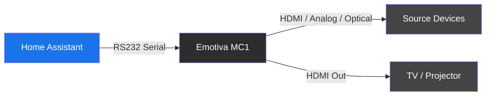

# Emotiva MC1 RS232

[![hacs][hacs-badge]][hacs-url] 

Control an Emotiva MC1 audio processor/preamp via RS232 serial in Home Assistant.

> **Status:** Early access (0.1.x). Tested on the author's own setup; expect rough edges and occasional breaking changes until 1.0. Please file issues on GitHub if anything is broken.

## Features

- **Media Player Entity** -- Volume, mute, source selection, and sound mode control
- **Input Source Selection** -- All MC1 inputs (HDMI 1-6, ARC, Bluetooth, Optical, Coax, Analog) with custom names and per-input enable/disable
- **Sound Modes** -- Stereo, Dolby Upmix, Multi Channel, DTS Neural:X, Pure, Direct
- **Precise Volume** -- dB-accurate levels with raw volume attribute
- **Send Command Service** -- `emotiva_mc1.send_command` for automations, validated against a command whitelist
- **Media DAG Attributes** -- Exposes input-to-device mapping for [Media Zone](https://github.com/ltomes/ha-media-zone) orchestration

## Requirements

- Emotiva MC1 processor/preamp
- USB-to-RS232 adapter with a DB9 male connector, connected from the HA host to the MC1's RS232 port

### Tested hardware

- [OIKWAN USB 2.0 to RS232 DB9 Male, FTDI chipset, 6ft](https://www.amazon.com/dp/B0759HSLP1) — straight-through, no null-modem adapter needed. FTDI-based adapters are strongly recommended over Prolific knockoffs for stability on Linux.

## Installation

### HACS (recommended)

1. In HACS, open the overflow menu (⋮) → **Custom repositories**.
2. Paste `https://github.com/ltomes/ha-emotiva-mc1`, pick type **Integration**, click **Add**.
3. Find **Emotiva MC1 RS232** in the HACS list and click **Download**.
4. **Restart Home Assistant.**
5. Go to **Settings → Devices & Services → Add Integration**, search for **Emotiva MC1 RS232**, and set up the integration (see [Configuration](#configuration)).

### Manual

Copy `custom_components/emotiva_mc1` to your HA `config/custom_components/` directory, restart, then add the integration from **Settings → Devices & Services**.

## Configuration

1. Settings > Devices & Services > Add Integration > "Emotiva MC1 RS232"
2. Select the serial port connected to the MC1
3. Choose the baud rate (default: 9600)

### Options

- **Enabled Sources** -- Select which inputs to show
- **Source Names** -- Rename any input (e.g., "HDMI 1" to "Shield")
- **Poll Interval** -- State query frequency (default: 30s)
- **Input-to-Device Mapping** -- Map inputs to source device entities for Media Zone

## Services

### `emotiva_mc1.send_command`

| Field | Required | Description |
|-------|----------|-------------|
| `command` | Yes | e.g., `power_on`, `volume_up`, `input_hdmi_1`, `mode_stereo` |
| `entry_id` | No | Target a specific MC1. Omit to send to all. |

## Part of the Media Zone Ecosystem

This integration works standalone, but pairs with [ha-media-zone](https://github.com/ltomes/ha-media-zone) to create a unified zone controller for your entire AV setup:

- [ha-media-zone](https://github.com/ltomes/ha-media-zone) -- Orchestrates receiver + display + sources into one entity
- [ha-nvidia-shield](https://github.com/ltomes/ha-nvidia-shield) -- Enhanced NVIDIA Shield TV with ADB media session tracking
- [ha-hisense-tv](https://github.com/ltomes/ha-hisense-tv) -- Hisense Google TV control via ADB + AirPlay

[hacs-badge]: https://img.shields.io/badge/HACS-Custom-41BDF5.svg
[hacs-url]: https://github.com/hacs/integration

## License

MIT
